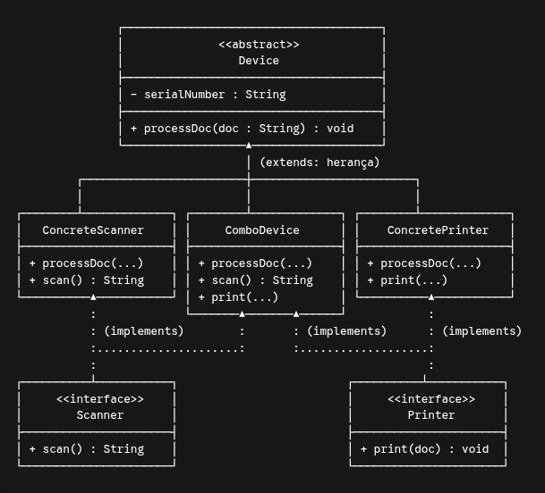

Vamos considerar a arquitetura em anexo que envolve classes abstratas e interfaces:
Não poderíamos ter as interfaces realizadas na classe abstrata ao inves de elas serem realizadas nas classes concretas?

**Não seria uma boa decisão de design**, embora do ponto de vista puramente sintático o compilador Java permitisse fazer `abstract class Device implements Scanner, Printer`.

Se colocássemos as duas interfaces diretamente na classe abstrata `Device`, a arquitetura do projeto seria comprometida por três motivos fundamentais:

- **Violação do Princípio da Segregação de Interfaces (ISP - SOLID):** Nem todo `Device` é simultaneamente impressora e scanner. Se `Device` implementar ambas as interfaces, ela forçará o contrato de digitalizar e imprimir para toda a hierarquia.
- **Quebra de coerência nas subclasses simples:**
- A classe `ConcreteScanner` herdaria a obrigação de ter `print(...)` sem ter a capacidade física de imprimir.
- A classe `ConcretePrinter` herdaria a obrigação de ter `scan()` sem possuir um leitor óptico.
- Você seria forçado a deixar implementações vazias ou lançar exceções do tipo `UnsupportedOperationException`, o que viola o **Princípio da Substituição de Liskov (LSP)**.

- **Falta de granularidade nos contratos:** Da forma como está modelado no diagrama:
- `ConcreteScanner` é apenas um `Device` e um `Scanner`.
- `ConcretePrinter` é apenas um `Device` e um `Printer`.
- Somente `ComboDevice` assume múltiplos papéis ao implementar simultaneamente as duas interfaces (`implements Scanner, Printer`).

A classe abstrata `Device` deve conter exclusivamente o que é **comum a todos os dispositivos** (o estado compartilhado `serialNumber` e o ciclo de vida base `processDoc`), deixando as capacidades periféricas específicas a cargo de cada subclasse concreta via interfaces.

