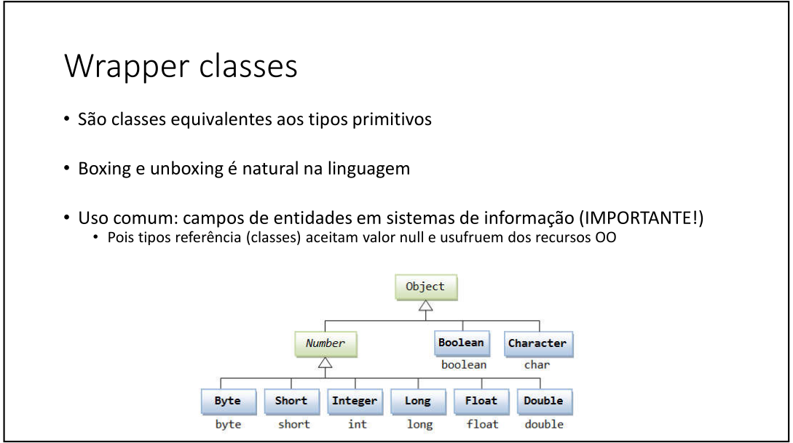

## Boxing, UnBoxing e Wrapper Class

### Boxing
---
É o processo de conversão de um objeto tipo valor para um objeto
tipo referência compatível

```java
int x = 20;
Object obj = x; // boxing
System.out.println(obj); // 20
```

### UnBoxing
---
É o processo inverso:  
conversão de um objeto tipo referência para um
objeto tipo valor compatível

```java
int y= (int) obj;// unboxing
System.out.println(y); // 20
```
- Observar que ao fazer unboxing o processo  é "forçado", através de um casting

- Boxing e unboxing é natural na linguagem  
### Wrapper classes
---
São classes que são **equivalentes** aos seus tipos primitivos.  
Ao se utilizar uma wrapper class, não há necessidade de fazer uma conversão(casting)

#### Uso comum: campos de entidades em sistemas de informação, como **BD's utilizando bastante Wrapper class** --> Aceitam valor null(classe) e usufruem dos recursos OO

```java
int z = 20;
Integer obj1 = z; //wrapper class
System.out.println(obj1); // 20

int k= obj1;
System.out.println(k); // 20
```
